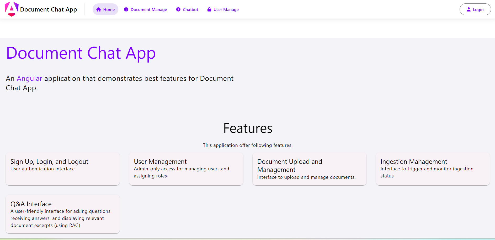
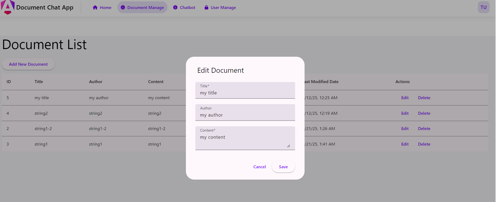
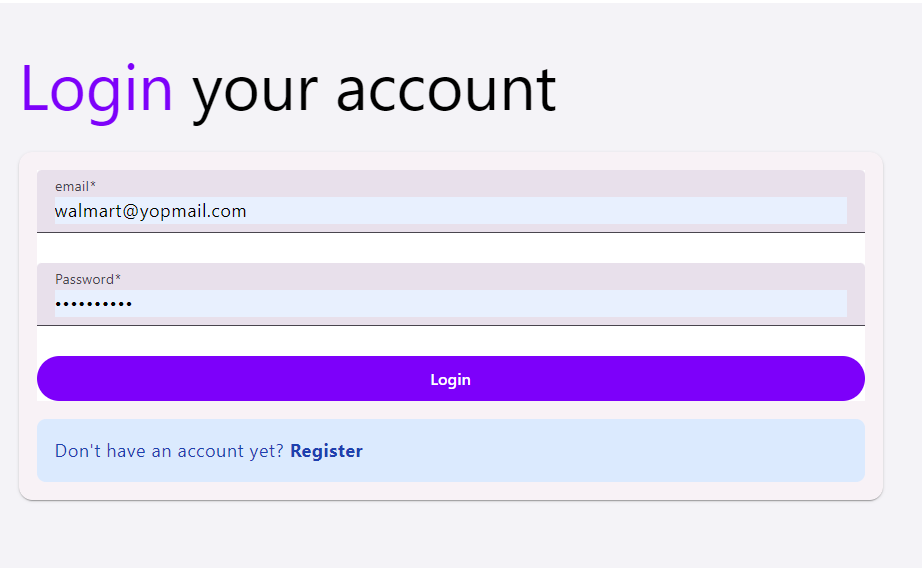

# Doc Chat UI

This project is a document management and chat interface built with Angular. It includes features for user authentication, user management, and document upload and management.

## Features

- **Sign Up, Login, and Logout**: User authentication interface.
- **User Management**: Admin-only access for managing users and assigning roles.
- **Document Upload and Management**: Interface to upload and manage documents.

## Getting Started

To get started with the project, follow these steps:

1. Clone the repository:
   ```sh
   git clone https://github.com/your-repo/doc-chat-ui.git
   cd doc-chat-ui
   ```
2. Install dependencies
    ```sh
    npm install
    ```

## Development server

Run `ng serve` for a dev server. Navigate to `http://localhost:4200/`. The application will automatically reload if you change any of the source files.

## Code scaffolding

Run `ng generate component component-name` to generate a new component. You can also use `ng generate directive|pipe|service|class|guard|interface|enum|module`.

## Build

Run `ng build` to build the project. The build artifacts will be stored in the `dist/` directory.

## Running unit tests

Run `ng test` to execute the unit tests via [Karma](https://karma-runner.github.io).

## Running end-to-end tests

Run `ng e2e` to execute the end-to-end tests via a platform of your choice. To use this command, you need to first add a package that implements end-to-end testing capabilities.

## Screenshot for reference



